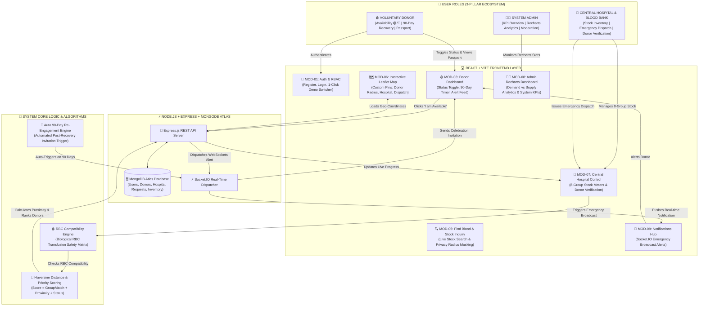

# COMPLETE MERMAID ARCHITECTURE DIAGRAM

Copy and paste the code block below directly into [Mermaid Live Editor](https://mermaid.live) or any Markdown viewer to render the complete visual module diagram for your project presentation:

